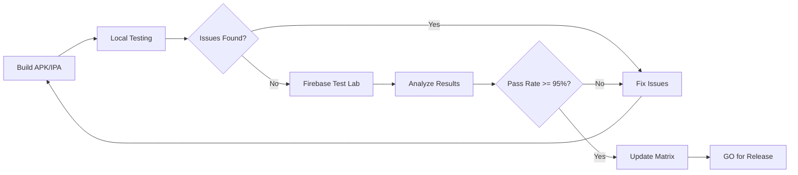

# Device Farm Testing - Quick Start

## Overview

Comprehensive device testing infrastructure for Juan Heart Mobile ensuring 95%+ compatibility across Android and iOS devices targeting the Philippine market.

**Status**: ✅ Infrastructure Ready (NOT VERIFIED AND TESTED)
**Last Updated**: 2025-01-10

## Quick Links

- 📋 [Device Farm Setup Guide](./device_farm_setup.md) - Complete setup instructions
- 🔢 [Device Compatibility Matrix](./device_compatibility_matrix.md) - Pass/fail status per device
- 📊 [Test Results](./device_test_results.md) - Detailed test execution results
- ⚡ [Performance Benchmarks](./performance_benchmarks.md) - Performance targets by device

## What's Included

### 1. Firebase Test Lab Configuration
**Location**: `test_lab/`
- `test_config.yaml` - Test Lab configuration
- `device_matrix.json` - Device specifications and priorities

**Devices Covered**:
- **Android**: 19 devices (API 21-33)
  - Low-end: Samsung Galaxy J2, Oppo A3s, Vivo Y11
  - Mid-range: Xiaomi Redmi Note 10, Samsung A52, Realme 8
  - High-end: Google Pixel 7, Samsung S23, OnePlus 11
- **iOS**: 12 devices (iOS 12.0-17.0)
  - Older: iPhone 7, iPhone 8, iPhone X
  - Current: iPhone 11, iPhone 12
  - Latest: iPhone 13, iPhone 14, iPhone 14 Pro

### 2. Integration Tests
**Location**: `integration_test/`
- `device_compatibility_test.dart` - Core functionality testing
- `performance_test.dart` - Performance benchmarking
- `ui_compatibility_test.dart` - UI rendering validation

**Tests Cover**:
- ✅ App installation and launch
- ✅ User authentication flows
- ✅ Heart risk assessment
- ✅ Offline/online sync
- ✅ Appointment booking
- ✅ Emergency features
- ✅ GPS facility search
- ✅ PDF/CSV generation
- ✅ Bilingual support (EN/FIL)
- ✅ UI rendering and accessibility
- ✅ Performance metrics
- ✅ Memory usage
- ✅ Battery consumption

### 3. Automation Scripts
**Location**: `scripts/`
- `device_farm_test.sh` - Firebase Test Lab execution
- `run_device_matrix.sh` - Local device testing

**Features**:
- Platform selection (Android/iOS/All)
- Device category filtering (Low/Mid/High)
- Test type selection (Compatibility/Performance/UI)
- Dry-run mode
- Parallel execution
- Automated reporting

### 4. Documentation
**Location**: `docs/testing/`
- Complete setup guide
- Device compatibility tracking
- Performance benchmarks
- Test results templates
- Troubleshooting guide

## Quick Start

### 1. Setup (One-time)

```bash
# Install dependencies
brew install google-cloud-sdk
npm install -g firebase-tools

# Authenticate
gcloud auth login
firebase login

# Set project
gcloud config set project juan-heart-mobile
```

### 2. Local Testing (Fast Feedback)

```bash
# Run on all local devices
./scripts/run_device_matrix.sh

# Run on Android only
./scripts/run_device_matrix.sh --platform android

# Run performance tests
./scripts/run_device_matrix.sh --test performance
```

### 3. Firebase Test Lab (Comprehensive)

```bash
# Dry run (see what would be tested)
./scripts/device_farm_test.sh --dry-run

# Test Android low-end devices
./scripts/device_farm_test.sh --platform android --category low

# Test all devices
./scripts/device_farm_test.sh --platform all
```

### 4. View Results

**Firebase Console**:
https://console.firebase.google.com/project/juan-heart-mobile/testlab

**Download Results**:
```bash
gsutil -m cp -r \
  gs://juan-heart-mobile-test-results/android-20250110-120000/ \
  ./test_lab/results/
```

## Performance Benchmarks

### Critical Thresholds (Must Meet)

**Low-End Devices** (Samsung Galaxy J2, 2GB RAM):
- ⚡ App Launch: <4s
- 💾 Memory: <200MB
- 🔋 Battery: <10%/hour
- ⏱️ Assessment: <30s

**Mid-Range Devices** (Xiaomi Redmi Note 10, 4GB RAM):
- ⚡ App Launch: <3s
- 💾 Memory: <150MB
- 🔋 Battery: <8%/hour
- ⏱️ Assessment: <20s

**High-End Devices** (Google Pixel 7, 8GB RAM):
- ⚡ App Launch: <2s
- 💾 Memory: <120MB
- 🔋 Battery: <6%/hour
- ⏱️ Assessment: <15s

## Device Priority Matrix

### Critical Priority
These devices **must pass** all tests:
- Samsung Galaxy J2 (API 21) - Most common low-end
- Xiaomi Redmi Note 10 (API 30) - Most common mid-range
- iPhone 8 (iOS 12.0) - Oldest supported iOS

### High Priority
These devices **should pass** most tests:
- Oppo A3s, Vivo Y11 - Common budget phones
- Samsung Galaxy A52 - Popular mid-range
- iPhone 11, iPhone 12 - Common iOS devices

### Medium Priority
These devices **nice to pass**:
- Google Pixel 7, Samsung S23 - Flagship Android
- iPhone 13, iPhone 14 - Latest iOS

## Known Device Issues

### MIUI Devices (Xiaomi)
**Issue**: Aggressive battery optimization kills background sync
**Workaround**: Request battery optimization exemption
**Test Focus**: Background sync reliability

### ColorOS Devices (Oppo)
**Issue**: Permission prompts on every launch
**Workaround**: Document permission setup
**Test Focus**: Permission persistence

### Huawei Devices
**Issue**: HMS vs GMS compatibility
**Workaround**: Ensure app works without Google Play Services
**Test Focus**: Core functionality without GMS

### iOS Devices with Notch
**Issue**: Safe area handling
**Workaround**: Use SafeArea widget everywhere
**Test Focus**: UI rendering at screen edges

## Test Execution Workflow



## Target Metrics

### Success Criteria
- ✅ 95% device compatibility (30/31 devices pass)
- ✅ All critical tests pass on all devices
- ✅ Performance meets benchmarks for each category
- ✅ No critical or high severity bugs
- ✅ Offline functionality works on all devices

### Current Status
- **Tested**: 0/31 devices (0%)
- **Passed**: 0
- **Failed**: 0
- **Pending**: 31
- **Status**: 🔄 Infrastructure ready, tests pending

## Next Steps

1. ✅ Setup Firebase Test Lab (infrastructure ready)
2. ⏳ Build APK/IPA for testing
3. ⏳ Execute first test run on critical devices
4. ⏳ Analyze results and fix critical issues
5. ⏳ Expand testing to full device matrix
6. ⏳ Achieve 95% compatibility target
7. ⏳ Integrate with CI/CD pipeline

## Cost Estimation

### Firebase Test Lab Pricing
- Virtual devices: $1/hour
- Physical devices: $5/hour
- Free tier: 10 virtual tests/day

### Estimated Costs
**Single Test Run** (all devices, ~1 hour):
- Virtual devices: 10 devices × $1 = $10
- Physical devices: 5 devices × $5 = $25
- **Total**: ~$35 per run

**Monthly** (2 runs/week):
- ~$280/month

**Optimization**:
- Use free tier (10 tests/day)
- Test critical devices first
- Run comprehensive tests weekly
- **Optimized**: ~$100/month

## Support and Resources

### Documentation
- [Flutter Testing Guide](https://flutter.dev/docs/testing)
- [Firebase Test Lab Docs](https://firebase.google.com/docs/test-lab)
- [Android Testing Guides](https://developer.android.com/training/testing)
- [iOS Testing Guides](https://developer.apple.com/documentation/xctest)

### Team Contacts
- **QA Lead**: JH-QA-Guardian
- **Dev Team**: jh-dev-prime
- **Support**: juanheart.dev@example.com

### Troubleshooting
Common issues and solutions in [device_farm_setup.md](./device_farm_setup.md#troubleshooting)

## File Structure

```
juan-heart-mobile/
├── test_lab/
│   ├── test_config.yaml          # Firebase Test Lab config
│   ├── device_matrix.json        # Device specifications
│   └── results/                  # Test results (gitignored)
├── integration_test/
│   ├── device_compatibility_test.dart
│   ├── performance_test.dart
│   └── ui_compatibility_test.dart
├── scripts/
│   ├── device_farm_test.sh       # Firebase Test Lab runner
│   └── run_device_matrix.sh      # Local device runner
└── docs/testing/
    ├── README.md                 # This file
    ├── device_farm_setup.md      # Setup guide
    ├── device_compatibility_matrix.md
    ├── device_test_results.md
    └── performance_benchmarks.md
```

## Contributing

When adding new devices:
1. Update `test_lab/device_matrix.json`
2. Update `docs/testing/device_compatibility_matrix.md`
3. Run tests on new device
4. Document any device-specific issues

When adding new tests:
1. Create test in `integration_test/`
2. Update `test_lab/test_config.yaml`
3. Update test documentation
4. Run on representative devices

---

**Status**: ✅ Infrastructure Complete (NOT VERIFIED AND TESTED)
**Ready for**: First test run execution
**Maintainer**: JH-QA-Guardian
**Version**: 1.0.0
